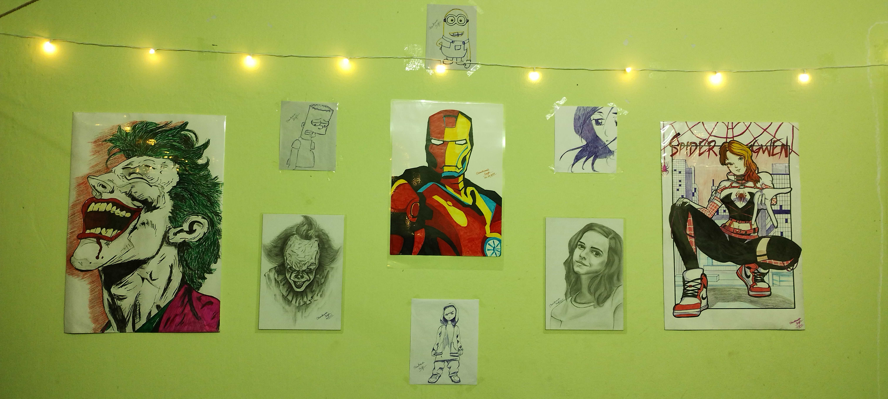

<h2 align="center">
   Hello! I'm Chandransh Singh 
</h2>

  <b>🎓 Third Year Undergraduate Student at IIT Kharagpur</b> 
  <b>📫 How to reach me: <a href="https://www.linkedin.com/in/chandransh-singh/">LinkedIn</a></b>

<h3 align="center">Languages and Tools</h3>

    

    

<!---->

  

